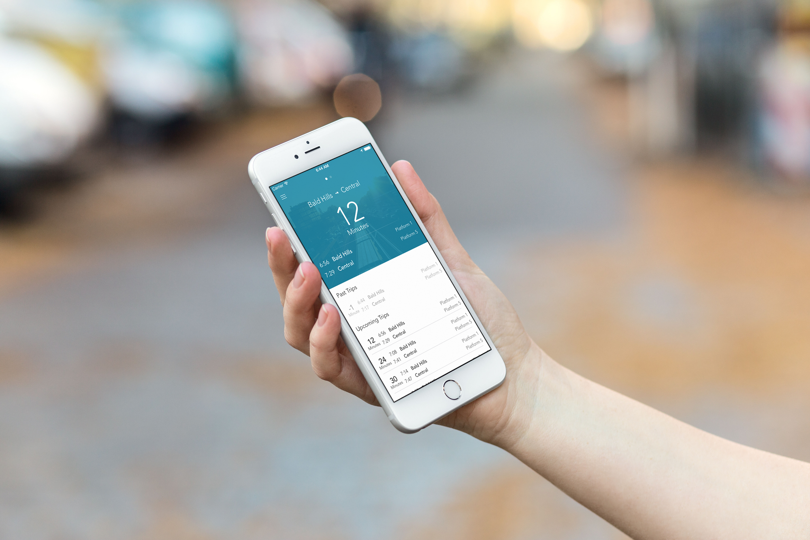

# Everyday App Marketing

### 7 April 2015
### @robpearson

---

# Initial experience w/ App Marketing

---

# App Marketing

1. Company background
1. Everyday Transit
1. Marketing Plan

---

# Maple Pixel Pty. Ltd.

- Founded in 2013
- Bootstrapped
- Part-time indie
- Goal: 2nd Revenue Stream
- Blog Post coming on this. (http://maplepixel.com.au/blog/)

---

# Everyday Transit 1.x

* Shipped 1.0 on 27-March
* Goal: 1000 sales in Financial Year
* ~90 Days before 30-June
* 1000/90 ~= 12 purchases per day

---

# HOW ?!?

---

# HOW

1. Ship iOS App
2. ?!?
3. Profit!

---

# App Marketing!

---

# Marketing is communicating the value of a product, service or brand to customers, for the purpose of promoting or selling that product, service, or brand.

* Wikipedia - http://en.wikipedia.org/wiki/Marketing

---

# Marketing Plan

1. Advertising
1. Get Featured by Apple
1. Get Featured by Non-Apple
1. Hustle
1. Expand Target Market
1. App Website
1. App Store Optimization (ASO)
1. Content Marketing (Blog)
1. Social Media
1. Contest

---

# ~~Advertising~~

---

# Get Featured by Apple

^ Apple Watch
^ Michael Simmons of Flexibits
<!--
- Professional Icon
- Work with a designer
- Have a great product
-->
^ Pitch to Apple App store manager

---

# Hustle

^ Hand out flyers
^ Train station flyer drops
^ Network (New Sites, Podcast etc)

---

# Expand Target Market

^ Currently supporting Brisbane train travel
^ Expand to Ferries, Trams and Buses.
^ Expand to Sydney, Melbourne, Adelaide etc.

---

# App Website

^ Polish it.

---

# App Store Optimization (ASO)

^ Good feedback on description and screenshots
^ App Store Video Preview
^ Improve app store keywords etc

---

# Content Marketing (Blog)

^ Start blogging to generate overall interest
^ Give back to the community

---

# Social Media

^ Twitter, Facebook and Instagram

---

# Contest

^ Apple Watch Giveaways

---

# Resources

* Traction: A Startup Guide to Getting Customers by Gabriel Weinberg and Justin Mares
* Copy Hackers copyhackers.com
* The Elements of User Onboarding - useronboard.com
* App Description
  http://blog.appbot.co/writing-a-great-app-store-description
* App Preview Dos and Don'ts
  http://blog.appannie.com/how-to-make-app-trailers-dos-donts/

---

# Questions
