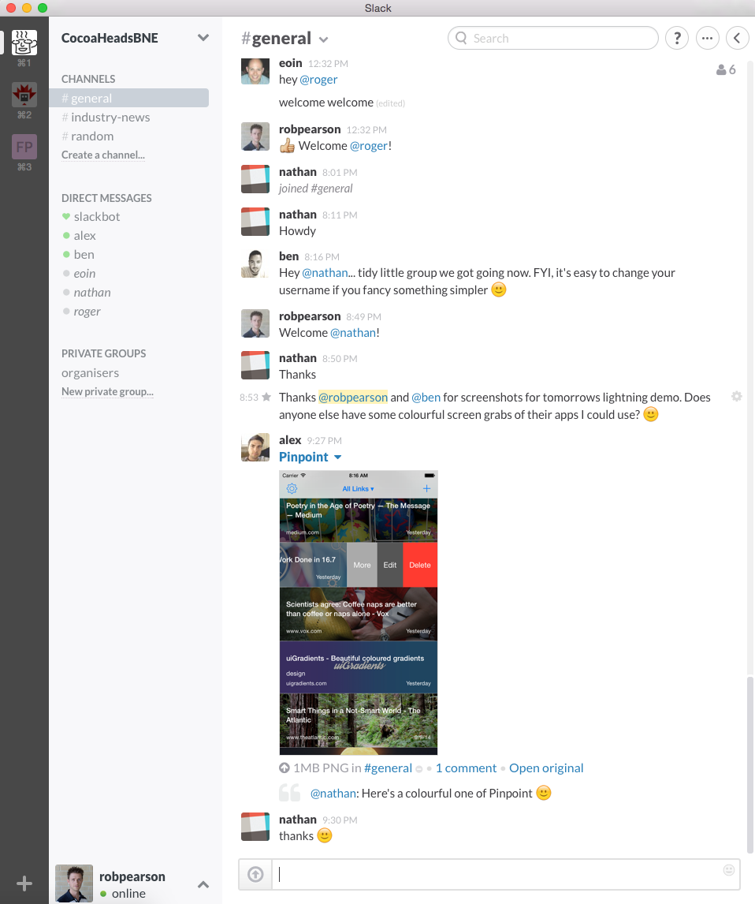
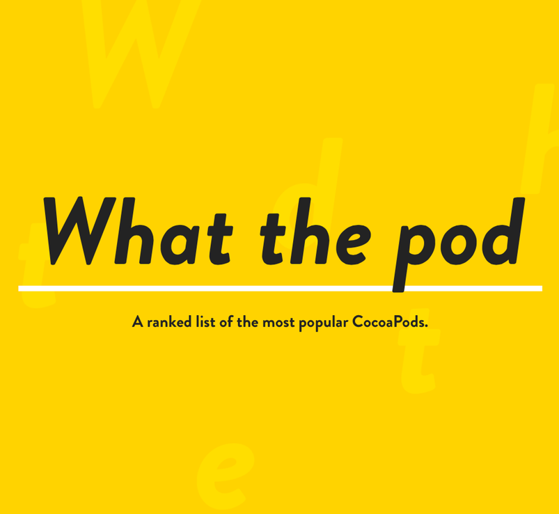

autoscale: true
# Brisbane Cocoaheads

### 4 August 2015
### @robpearson
###### Photo Credit: flickr.com/spugster

---

#         #Sponsor

---

# RCL Accellerator

* Funding 5 startups 20k for 3% equity
* Full time desk space for the team at RCL
* 3-month journey through the accelerator.

http://accelerator.rivercitylabs.net

---

# [fit] Agenda

---

# [fit]Lightning Talks

### Thanks to Melbourne Cocoaheads for the idea! ;)

---

# Agenda

- Rob (@robpearson) News!
- ~~Nick (@nicktd) will talk about hit git workflow~~
- Tate (@tatey) talking about Carthage for managing dependencies
- Lachlan (@lachlanroche) will talk about Xcode keyboard secrets!
- Sarah (@sarah_j_smith) will talk about SpriteKit using Swift!
- Simon will talk GameplayKit path finding!
- ~~Rob (@robpearson) will talk about changes in Watch OS 2.0~~

---

# [fit] Next Month
# [fit] New APIs Theme!
## Call for Speakers

---

# Slack Team Site

### http://bit.ly/1dEHMPI

^ https://cocoaheads-slackin.herokuapp.com

---

# whatthepod.com

1. **ZCAnimatedLabel** - UILabel with appear/disappear animation
2. **AttributedLabel** - Fast, Flexible Attributed UILabel.
3. **WSProgressHUD** - Flexible Progress HUD.  Based on SVProgressHUD.

---

# The WWDC Index
## New stuff from WWDC 2015 by Kuba Suder

https://gist.github.com/mackuba/15994186a4f9d7da3137

---

# Creating perfect App Store Screenshots of your iOS App
## Felix Krause

https://krausefx.com/blog/creating-perfect-app-store-screenshots-of-your-ios-app

---

# Should I use a Swift struct or a class?
## Drew Crawford

http://faq.sealedabstract.com/structs_or_classes/

---

# App Websites
## LaunchKit.io

https://launchkit.io/websites/

---

# Objective-C in a Swift World
## Ben Sandofsky

https://sandofsky.com/blog/objective-c-in-a-swift-world.html

---

# Meaningful Design for Apple Watch
## Peter Lewis

https://medium.com/the-apple-watch-project/apple-watch-and-the-evolution-of-mobile-devices-11ad06968b39

---

# App Store Health Check
## Appbot

http://healthcheck.appbot.co

---

# AltConf 2015 Videos
## AltConf 2015 Videos

https://realm.io/altconf/

---

# Apple disables app reviews for beta iOS releases
## Finally ...

http://www.macrumors.com/2015/07/22/ios-9-beta-app-store-reviews-disabled/

---

# Cache Me If You Can
## Soroush Khanlou

http://khanlou.com/2015/07/cache-me-if-you-can/

---

# 4 iOS Rules to Break
## nn group

http://www.nngroup.com/articles/4-ios-rules-break/

---

# Half-Assed
## Craig Hockenberry

http://furbo.org/2015/07/22/half-assed/

---

# iOS Build Infrastructure
## Square

https://corner.squareup.com/2015/07/ios-build-infrastructure.html

---

# Swift Error Handling and Objective-C Interop in Depth
## Benjamin Encz

http://blog.benjamin-encz.de/swift-error-handling-and-objective-c-interop-in-depth/
