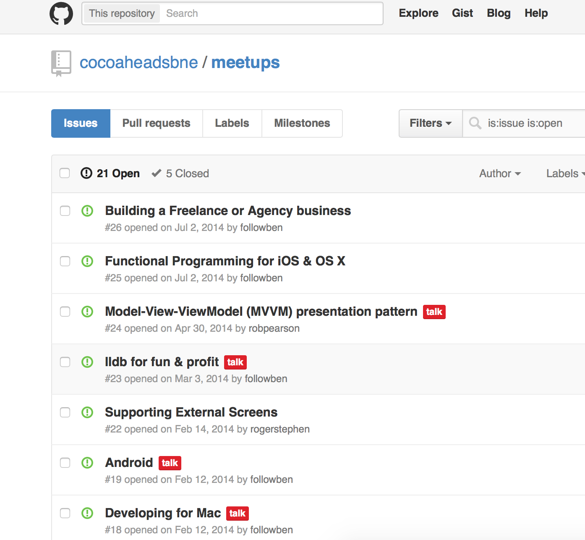

# Brisbane Cocoaheads

### 2 June 2015
### @robpearson
###### Photo Credit: flickr.com/spugster

---

#         #Sponsor

---

# Agenda

- Rob (@robpearson) News!
- Michael Gianarakis (@mgianarakis) will talk about "Designing Secure iOS Applications"
- Mark Jones (@yourdigitalsoln) will talk about how his company (Your Digital Solution) uses iBeacons in the wild

---

# Slack Team Site

### http://bit.ly/1dEHMPI

^ https://cocoaheads-slackin.herokuapp.com

---

# CocoaheadsBNE Github site

### https://github.com/cocoaheadsbne/meetups/issues

---

# whatthepod.com

1. KRVideoPlayer
2. openshare
4. SwiftDate

---

# Ruthlessly Simple Dependency Management with Carthage

### http://realm.io/news/swift-dependency-management-with-carthage/

---

# Everyday Transit v1.0

* Shipped 1.0 on 27-March; 1.1 coming soon ...
* Beta Tester w/  watch needed!
* Goal: 1000 sales in Financial Year
* ~60 Downloads; ~$140 Profit
* http://EverydayTransitApp.com

---

# News  

---

# [fit] WWDC
# Next Week!

---

# Redacted for Mac Launch

### http://blog.soff.es/redacted-for-mac-launch/

---

# Release Notes Podcast

## http://releasenotes.tv

---

# NSConf 7

## https://vimeo.com/channels/nsconf7

---

# Redesigning Overcast's Apple Watch App

## http://www.marco.org/2015/05/08/overcast-apple-watch-redesign

---

# WatchKit Image Tips

### http://blog.mikeswanson.com/post/118580394879/watchkit-image-tips

---

# Apple Watch Tips and Tricks

#### http://www.totem.training/swift-ios-tips-tricks-tutorials-blog/apple-watch-lessons-learned

---

# Gitup

http://gitup.co/

---

# WWDC Parties

## https://2015.wwdcparties.com

---

# YOW! Connected CFP

## http://connected.yowconference.com.au/call-for-presentations/
