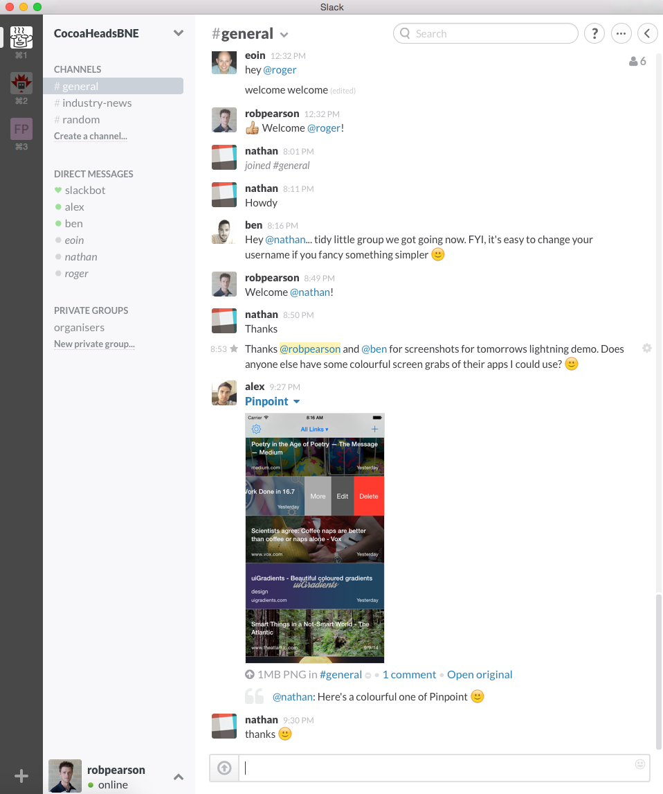

# Brisbane Cocoaheads

### 3 March 2015
### @robpearson

---

# Thanks to Thoughtworks!
## #Sponsor

---

# Thanks to Itty Bitty Apps!
## #Sponsor

---

# Agenda

* Monthly News
* @robpearson App Demo - Everyday Transit
* @eoinmcc App Demo - Whitelabel
* @alextrob App Demo - PinPoint
* Nathan Ter Bogt - App Demo - Whitelabel
* @eoinmcc - Continous Delivery for iOS
* @followben - Reveal Demo and License Giveaway

---

# CocoaheadsBNE Slack Team Site

### Ask Questions
### Share News

---

# whatthepod.com

1. DFImageManager
2. SKTagView
3. IFTTTLaunchImage

---

# Apple Watch

## Spring Forward Event
## 9 March 2015

http://www.loopinsight.com/2015/02/26/apple-announces-media-event-for-march-9/

---

# Swift 1.2 and Xcode 6.3 beta

https://developer.apple.com/swift/blog/?id=22

---

# First Impressions using Reactive Native

http://jlongster.com/First-Impressions-using-React-Native

---

# Apple Pairs with Pinterest

http://bits.blogs.nytimes.com/2015/02/12/apple-pairs-with-pinterest-for-better-app-discovery/?_r=1

---

# Apple Crash Reporting

http://appleinsider.com/articles/15/02/23/apple-introduces-new-crash-reporting-service-for-developers-in-latest-xcode-63-beta

---

# Reveal 1.5

---

# The shape of things to come

http://www.newyorker.com/magazine/2015/02/23/shape-things-come

---

# Does Sponsoring Daring Fireball Actually Work?

http://blog.desk.pm/df/

---

# Developers reveal upcoming titles

http://www.wareable.com/apple-watch/best-apple-watch-apps-832

---

# Core Animator

http://www.coreanimator.com

---

# Learn Design Principles

http://learndesignprinciples.com

---
