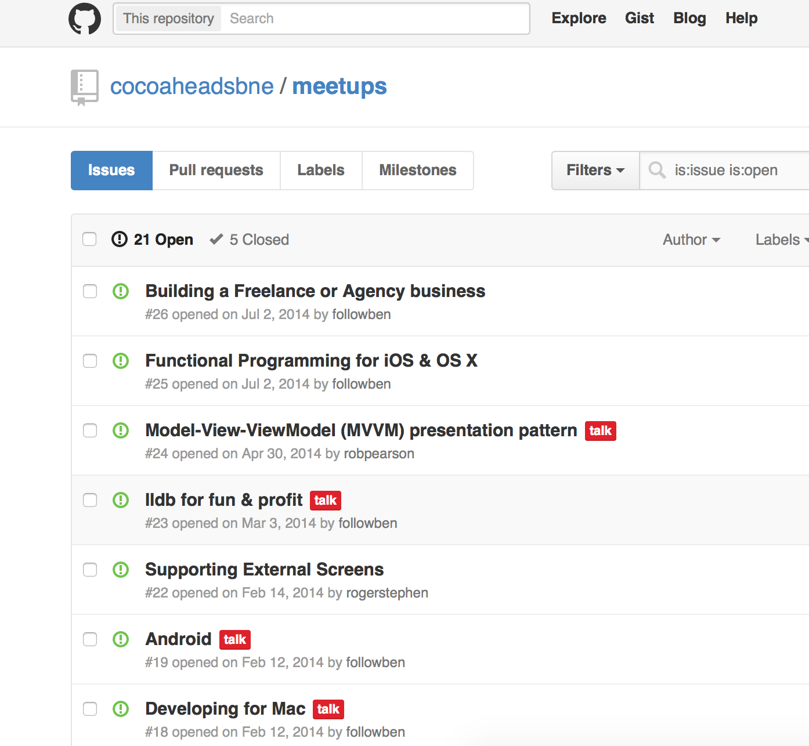

# Brisbane Cocoaheads

### 5 May 2015
### @robpearson

---

#         #Sponsor

---

# Agenda

- Rob (@robpearson) News!
- Gabriel (@gabrielhauber) More App Marketing!
- Tate (@tatejohnson) WatchKit: Animating like it’s 1999

---

# Slack Team Site

### http://bit.ly/1dEHMPI

^ https://cocoaheads-slackin.herokuapp.com

---

# CocoaheadsBNE Github site

### https://github.com/cocoaheadsbne/meetups/issues

---

# whatthepod.com

1. CSGrowingTextView
2. MinimalTabBar
3. AMTagListView

---

# Everyday Transit v1.0

* Shipped 1.0 on 27-March; 1.1 coming soon ...
* Goal: 1000 sales in Financial Year
* 43 Downloads; >$100 Profit
* App Marketing starting soon ...
* http://EverydayTransitApp.com

---

# Apple Watch

### apple.com

^ The past month was definiately about the apple watch!
^ Everyday I go to the Brisbane CBD apple store and visit my future watch!

---

# WWDC
### apple.com

---

# App Store Analytics

### https://itunesconnect.apple.com

---

# ResearchKit
### http://researchkit.github.io/

^ It even looks like PRs for CocoaPods and Carthage support will be merged.
^ Keen for a presso on Carthage as I had a hell of a month w/ CocoaPods

---

# Xcode Code Signing

### http://blog.jaredsinclair.com/post/116436789850/follow-these-guidelines-and-never-struggle-with

---

# Twitterific for Apple Watch

### http://blog.iconfactory.com/2015/04/twitterrific-for-apple-watch/

---

# Thoughts on Increaseing App Revenue

### http://dancounsell.com/articles/thoughts-on-increasing-app-revenue

^ 1. Update often and listen to your customers
^ 2. Improve App Store metadata
^ 3. Localise your app
^ 4. Ask customers to rate your app
^ 5. Market outside the App Store

---

# My Biggest Watchkit Mistake

### http://realm.io/news/watchkit-mistakes/

^ Plug Realm and they awesome videos/post they do

---

# Ruthlessly Simple Dependency Management with Carthage

### http://realm.io/news/swift-dependency-management-with-carthage/

^ Same thing.  Great talk and matching blog post.

---

# ReactiveCocoa 3.0   Boom!
### http://nomothetis.svbtle.com/an-introduction-to-reactivecocoa

---

# Bonus Apple Watch WatchKit Links

* _David Smith http://david-smith.org/blog/2015/04/30/ailw-thinking-about-load-time/
* Mike Swanson http://blog.mikeswanson.com/post/117807821714/watchkit-development-tips
*  Pttrns http://pttrns.com/?did=8
